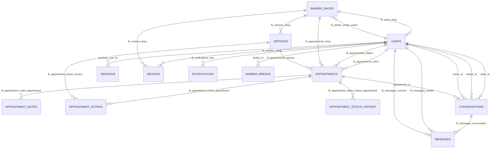

# Modelo (DML) de la Base de Datos — Proyecto X

## Fuente del esquema
Este modelo se generó a partir de:

- `backend/src/db/schema.sql`
- `backend/src/db/barber_breaks.sql`

Si tu BD productiva difiere (por ejemplo, si usas scripts de `supabase/migrations` u otro `schema.sql`), dímelo y lo regenero.

## Convenciones
- **PK**: Primary Key
- **FK**: Foreign Key
- **UK**: Unique Key

## Diagrama Entidad–Relación (ER)

## Relación y cardinalidad (resumen)
- **barber_shops** 1—N **users** (por `users.shop_id`)
- **users** (owner) 1—N **barber_shops** (por `barber_shops.owner_id`)
- **barber_shops** 1—N **services**
- **appointments** relaciona **client** (users) + **barber** (users) + **shop** + **service**
- **appointments** 1—N **appointment_notes**, **appointment_extras**, **appointment_status_history**
- **conversations** relaciona participantes y opcionalmente una cita
- **messages** pertenece a una conversación
- **notifications** pertenece a un usuario
- **barber_breaks** pertenece a un barbero (usuario)

## Reglas/constraints relevantes
- **No doble slot para el mismo barbero**: `appointments` tiene `UNIQUE (barber_id, date)`.
- **Breaks (descansos) únicos por día/tipo**: `barber_breaks` tiene `UNIQUE (barber_id, day, break_type)`.

## Enumeraciones / valores esperados
- `users.role`: `'barber' | 'client' | 'owner'`
- `appointments.status`: típicamente `'confirmed' | 'completed' | 'cancelled' | 'no-show'` (y otros estados que el frontend pueda manejar)
- `barber_breaks.day`: `'L','M','X','J','V','S','D'`
- `barber_breaks.break_type`: `'breakfast' | 'lunch' | 'dinner'`

## Objetos principales por módulo
- **Autenticación**: `users`, `sessions`
- **Core booking**: `appointments`, `services`, `barber_shops`
- **Productos**: `products`
- **Reseñas**: `reviews`
- **Mensajería interna**: `conversations`, `messages`, `notifications`
- **Disponibilidad/descansos**: `barber_breaks`
